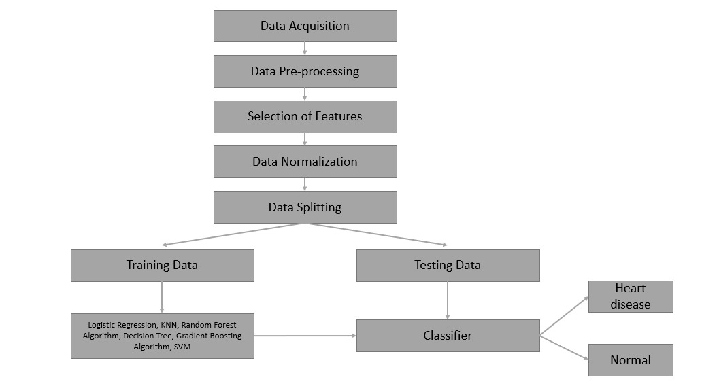
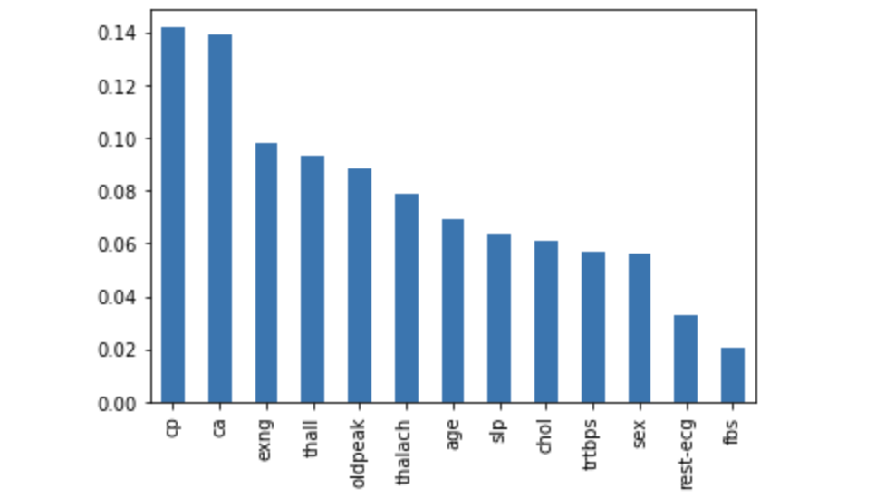
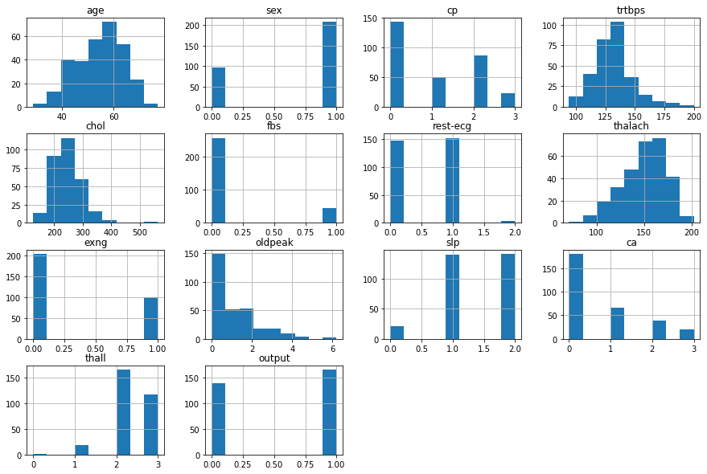

# Heart Disease Prediction: A Statistical Machine Learning Approach

## 📌 Project Overview
This project was developed as part of the **Statistical Machine Learning** coursework during my Master's program at Arizona State University. It focuses on predicting the presence of heart disease using the UCI Heart Disease dataset. By analyzing various non-invasive clinical attributes, this project implements and compares six different machine learning classification models to determine which provides the most reliable diagnostic support.



## 📊 Dataset Description
The project utilizes the **UCI Heart Disease dataset**, consisting of **303 instances** and **14 key attributes** (13 predictive features and 1 target variable). The complete list of features includes:

## 📊 Dataset Description
The project utilizes the **UCI Heart Disease dataset**, consisting of **303 instances** and **14 key attributes** (13 predictive features and 1 target variable). The complete list of features includes:


**Demographics:**
* **age:** Age of the patient in years
* **sex:** Gender of the patient (1 = male, 0 = female)

**Clinical Measurements:**
* **trtbps:** Resting blood pressure (in mm Hg)
* **chol:** Serum cholesterol in mg/dl
* **fbs:** Fasting blood sugar > 120 mg/dl (1 = true; 0 = false)
* **thalach:** Maximum heart rate achieved during exercise

**Symptoms & ECG Results:**
* **cp:** Chest pain type (0 = typical angina, 1 = atypical angina, 2 = non-anginal pain, 3 = asymptomatic)
* **restecg:** Resting electrocardiographic results (0 = normal, 1 = having ST-T wave abnormality, 2 = showing probable or definite left ventricular hypertrophy)
* **exng:** Exercise-induced angina (1 = yes; 0 = no)
* **oldpeak:** ST depression induced by exercise relative to rest
* **slope:** The slope of the peak exercise ST segment (0 = upsloping, 1 = flat, 2 = downsloping)

**Advanced Tests:**
* **ca:** Number of major vessels (0-3) colored by fluoroscopy
* **thal:** Thalassemia blood disorder (1 = normal; 2 = fixed defect; 3 = reversable defect)

**Target Variable:**
* **target:** Diagnosis of heart disease (0 = less chance of heart disease, 1 = more chance of heart disease)



## 🛠️ Methodology
The project follows a rigorous data science pipeline to ensure high model reliability:
1. **Exploratory Data Analysis (EDA):** Visualizing distributions, handling skewness, and identifying correlations between clinical factors.
2. **Data Preprocessing:**
    * **Handling Outliers:** Replacing out-of-range and inconsistent values with median values to maintain dataset integrity.
    * **Normalization/Scaling:** Scaling numerical features (like cholesterol and heart rate) to ensure they are comparable, which is crucial for distance-based algorithms.
3. **Feature Selection:** Identifying the most influential clinical parameters.
4. **Modeling & Evaluation:** Implementing various algorithms with hyperparameter tuning and evaluating them using multiple metrics.

## 🚀 Models Evaluated
We compared six classification algorithms:
1. **K-Nearest Neighbor (KNN)**
2. **Logistic Regression**
3. **Support Vector Machine (SVM)**
4. **Decision Tree Classifier**
5. **Random Forest Classifier**
6. **Gradient Boosting Classifier**

We used four primary metrics for evaluation: **Accuracy Score, F1-Score, Jaccard Index, and Log Loss**.

  

## 🏆 Key Findings & Results
* **Top Performer:** The **Random Forest Classifier** demonstrated the highest overall performance across all accuracy and F1-score metrics.
* **Clinical Significance:** In medical diagnostics, minimizing **False Negatives (FN)** is absolutely critical to ensure no potential heart disease cases are overlooked. Our analysis revealed that both **Random Forest** and **Logistic Regression** yielded the lowest FN values, making them the safest and most reliable models for clinical decision support.

## 💻 Tech Stack
* **Language:** Python 3.x
* **Environment:** Jupyter Notebook
* **Libraries:** `pandas`, `numpy`, `matplotlib`, `seaborn`, `scikit-learn`

## 📁 Repository Structure
```text
├── HEART.ipynb                  # Full Python implementation, EDA, and model training
├── CSE575_Group10_Report.pdf    # Detailed Statistical Machine Learning Project Report
└── dataset/                        # Dataset folder (UCI Heart Disease)
    └── heart-dataset.csv           # CSV File
